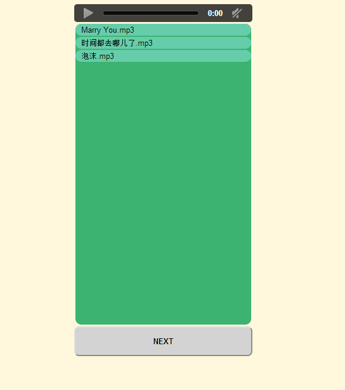

music-player
============

a simple music player: Golang for the back-end, html5 and jQuery for the front-end 

How to
============
* install golang    [windows/linux both OK]
* then

```shell
go run player.go [port] [music folder path]
```
  * e.g. go run player.go 8080 ./music       the `music` folder contains the music files(.mp3, .wma ...)

  * open `localhost:8080` in a browser which suport html5, chrome highly recommended

Screenshot
============

